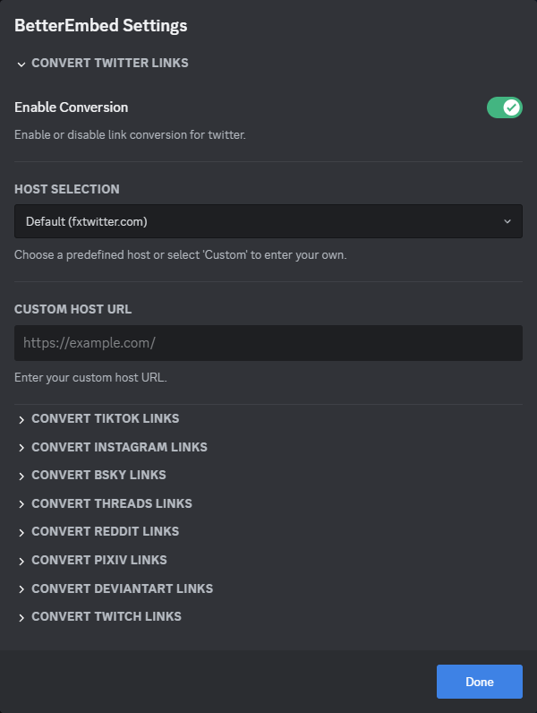

<h1 align="center">
  SocialMediaLinkConverter
</h1>

    SocialMediaLinkConverter is a BetterDiscord plugin that enhances the embedding of links from various social media platforms. When you share links from these platforms on Discord, SocialMediaLinkConverter automatically fixes them to properly embed.

    

## Features

-   **Link Conversion**: Supports link conversion for various social media platforms, including Reddit, Twitch (Clips), Twitter, Instagram, and more.
-   **Customizable**: Offers the flexibility to enable or disable link conversion for each platform individually.
-   **Predefined and Custom Hosts**: Choose from predefined hosts or specify your own.

## Installation

1. Ensure you have BetterDiscord installed. If not, download and install it from [BetterDiscord's official website](https://betterdiscord.app/).
2. Download the `SocialMediaLinkConverter.plugin.js` file from the [official repository](https://github.com/RoyRiv3r/SocialMediaLinkConverter.plugin.js/blob/main/SocialMediaLinkConverter.plugin.js) or [BetterDiscord plugin repository]() (coming soon).
3. Navigate to your BetterDiscord plugins folder. You can find this folder by going to User Settings > Plugins > Open Plugin Folder within Discord.
4. Drag and drop the `SocialMediaLinkConverter.plugin.js` file into the plugins folder.
5. Enable the SocialMediaLinkConverter plugin from the BetterDiscord plugins tab.

## Usage

Once installed and enabled, SocialMediaLinkConverter works automatically. Links from the supported platforms shared in Discord will be converted to their respective modified formats for better embedding.

To customize the plugin settings:

1. Go to User Settings > Plugins.
2. Find SocialMediaLinkConverter in the list and click on the settings button.
3. From here, you can enable or disable link conversion for each supported platform, choose predefined hosts, or specify custom hosts.

## Contributing

Contributions are welcome! If you'd like to contribute, feel free to fork the repository and submit a pull request.

## Support

If you encounter any issues or have suggestions for improvements, please open an [issue](https://github.com/RoyRiv3r/SocialMediaLinkConverter.plugin.js/issues/new).

## Previews

    <video width="100%" controls>
        <source src="./demo/better-embed.mp4" type="video/mp4">
    </video>

  

## Acknowledgements

The build tools for this project are based on [JustOptimize's](https://github.com/JustOptimize) [return-ShowHiddenChannels](https://github.com/JustOptimize/return-ShowHiddenChannels) plugin.

## License

This project is licensed under GPLv3 - see the [LICENSE](https://github.com/RoyRiv3r/SocialMediaLinkConverter.plugin.js/blob/main/LICENSE) file for details.  
SocialMediaLinkConverter is not affiliated with Discord or any of the platforms it supports for link conversion. All product names, logos, and brands are property of their respective owners.
